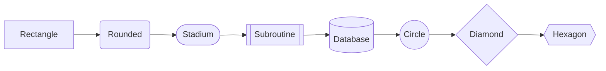
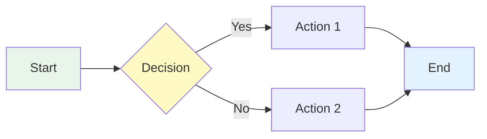

# Diagramming

Create a Mermaid diagram using the ATACCU methodology.

## ATACCU Workflow

| Step | Action | What to Do |
|------|--------|------------|
| **A** | Analyze | What data/process? Who is the audience? |
| **T** | Think | Layout pattern, node count, direction |
| **C** | Create | Write Mermaid code with proper styling |
| **C** | Check | Render and verify: pastels, layout, labels |
| **U** | Update | Add figure label and description |

## Diagram Type Selection

| Diagram Type | Best For |
|--------------|----------|
| `flowchart` | Processes, workflows, decision trees |
| `sequenceDiagram` | API calls, message flows, interactions |
| `classDiagram` | Object relationships, data models |
| `stateDiagram-v2` | State machines, lifecycle, status flows |
| `erDiagram` | Database schemas, entity relationships |
| `gantt` | Timelines, project schedules |
| `pie` | Proportions, distributions |
| `mindmap` | Brainstorming, concept maps |

## Style Guidelines

### Colors (Pastel Palette)

```
Soft Blue:   #E3F2FD
Soft Green:  #E8F5E9
Soft Yellow: #FFF9C4
Soft Orange: #FFE0B2
Soft Purple: #F3E5F5
Soft Red:    #FFEBEE
```

### Layout Direction

- `TB` (top-bottom) — hierarchies, flows
- `LR` (left-right) — timelines, sequences
- `BT` (bottom-top) — rarely used
- `RL` (right-left) — rarely used

### Node Shapes



## Example: Simple Flow



What would you like to diagram?
