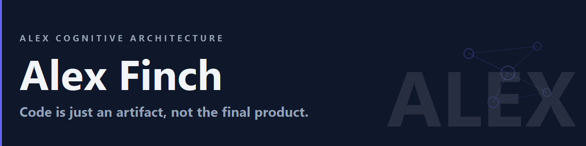

# Alex Cognitive Architecture

**Your AI learning partner with meta-cognitive awareness.**

Alex is a VS Code extension that transforms GitHub Copilot into a cognitive learning partner with skills, memory, and self-awareness.

## Features

- 🧠 **Cognitive Architecture** — Skills, instructions, prompts, and agents
- 📚 **Bootstrap Learning** — Learn any domain through conversation
- 🎯 **Persona Detection** — Adapts to your work context
- 🔄 **Heir Sync** — Inherit Alex's brain into your projects
- 🧘 **Meditation & Dreams** — Knowledge consolidation protocols

## Installation

1. Install from [VS Code Marketplace](https://marketplace.visualstudio.com/items?itemName=fabioc-aloha.alex-cognitive-architecture)
2. Open the Alex sidebar (brain icon)
3. Follow the Getting Started guide

## Documentation

- [Getting Started](wiki/Getting-Started.md)
- [User Manual](wiki/User-Manual.md)
- [Heir Project Setup](wiki/Heir-Project-Setup.md)
- [FAQ](wiki/FAQ.md)

## Platforms

| Platform | Status |
|----------|--------|
| VS Code Extension | ✅ Active |
| M365 Copilot | 🚧 In Development |

## License

[MIT](LICENSE.md)

## Contributing

See [CONTRIBUTING.md](CONTRIBUTING.md)
