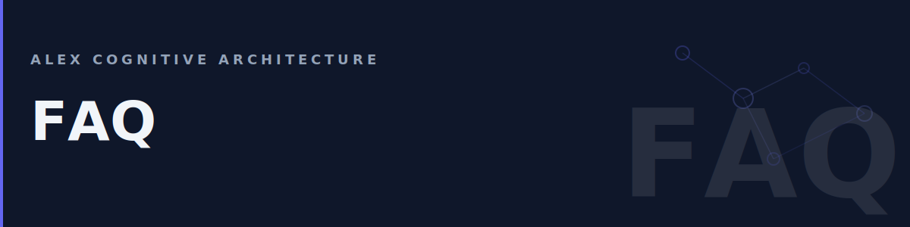

# Frequently Asked Questions



Common questions about Alex and quick answers.

## General

### What is Alex?

Alex is a cognitive learning partner that lives in VS Code. Unlike traditional AI assistants, Alex remembers context across sessions, learns from your work patterns, and adapts to your project.

### How is Alex different from regular Copilot?

| Feature | Copilot Chat | Alex |
|---------|--------------|------|
| **Memory** | Session only | Persistent connections + episodic |
| **Learning** | None | Continuous through meditation |
| **Agents** | Single | 18 specialized agents |
| **Skills** | Generic | 182 domain-specific |
| **Adaptation** | None | Project-aware persona |

### Does Alex require a separate subscription?

No. Alex uses GitHub Copilot's underlying models. You need a Copilot subscription, but Alex itself is free.

### Is my data private?

Yes. Alex stores memory locally in your workspace (`.github/` folder). No data is sent to external servers beyond what Copilot normally processes.

## Installation

### How do I install Alex?

1. Open VS Code Extensions (`Ctrl+Shift+X`)
2. Search "Alex Cognitive Architecture"
3. Click Install

See [Getting Started](Getting-Started) for detailed instructions.

### What VS Code version do I need?

VS Code 1.100 or later. Alex uses features from recent VS Code releases.

### Does Alex work with VS Code forks (Cursor, etc.)?

Alex is designed for VS Code. Compatibility with forks is not guaranteed.

## Usage

### How do I talk to Alex?

Open Copilot Chat (`Ctrl+Shift+I`) and just talk naturally:

```
Help me debug this function
```

Alex understands context and intent — no special syntax required. For more examples, see [Talking to Alex](User-Manual#talking-to-alex).

> **Tip:** Power users can use `@alex` prefix to explicitly address Alex when multiple participants are installed. See [Advanced Syntax](User-Manual#advanced-syntax).

### What's the difference between agents?

Alex has 18 specialized agents. Here are the most commonly used:

| Agent | Best For |
|-------|----------|
| **Alex** | General conversations, broad questions |
| **Builder** | Writing code, implementing features |
| **Researcher** | Learning new topics, investigations |
| **Validator** | Code review, testing, quality checks |
| **Planner** | Architecture, roadmaps, planning |
| **Documentarian** | READMEs, wikis, documentation |
| **Presenter** | Demos, presentations, stakeholder docs |
| **Frontend** | React, TypeScript, UI development |
| **Backend** | APIs, FastAPI, data services |
| **Infrastructure** | Azure, Bicep, IaC |

See the [User Manual](User-Manual#agents) for the full list of all 18 agents.

### Can I use Alex without the @alex prefix?

In agent mode, you can configure Alex as the default Copilot participant. See [User Manual](User-Manual#settings).

## Sidebar

### What are the three tabs?

| Tab | Purpose | Details |
|-----|---------|---------|
| **Loop** | Guided workflows for development | [Loop Tab](Loop-Tab) |
| **Autopilot** | Automated recurring tasks | [Autopilot](Autopilot) |
| **Setup** | Workspace config, brain health, memory | [Setup Tab](Setup-Tab) |

### Can I customize which agents appear in VS Code Copilot's @ dropdown?

No — the agent picker in VS Code Copilot Chat is a **VS Code built-in feature**, not part of Alex. VS Code auto-discovers agents from `.github/agents/*.agent.md` files and displays them alphabetically.

What you CAN customize:

| What | Config File | Controls |
|------|-------------|----------|
| **Loop tab buttons** | `.github/config/loop-menu.json` | Button groups, labels, prompts |
| **Autopilot tasks** | `.github/config/scheduled-tasks.json` | Scheduled automation |
| **Agent definitions** | `.github/agents/*.agent.md` | Agent names, descriptions, instructions |

What you CANNOT customize via Alex:

- Agent ordering in VS Code's @ dropdown
- Hiding specific agents from the dropdown
- Grouping agents in the dropdown

If you want only certain agents visible in a project, delete or rename the agent files you don't want. Agents without `.agent.md` files won't appear.

### Why are my Loop buttons in a different order?

Buttons reorder automatically based on usage frequency (frecency). The more you click a button, the higher it appears. Creative Loop is the exception — it always stays in 1-through-6 order. See [Frecency Sorting](Loop-Tab#frecency-sorting).

### What does the Health Pulse mean?

The colored dot at the top of the Loop tab shows brain health:

| Color | Status | Action |
|-------|--------|--------|
| Green | Healthy | None needed |
| Yellow | Attention | Run a dream when convenient |
| Red | Critical | Run a dream soon — 14+ days overdue |
| Gray | Unknown | Run your first dream to establish a baseline |

### How do I find my memory files?

Open the **Setup** tab → **User Memory** group. Buttons there open each memory location directly in your file explorer or editor. See [User Memory](Setup-Tab#user-memory).

### What's the difference between Dream, Meditate, and Self-Actualize?

| Process | Speed | What It Does |
|---------|-------|-------------|
| **Dream** | Fast | Automated file validation and repair |
| **Meditate** | Medium | Conversational knowledge consolidation |
| **Self-Actualize** | Slow | Deep architecture assessment and growth planning |

See [Brain Status](Setup-Tab#brain-status) for details.

## Memory & Learning

### What are connections?

Connections are learned links between concepts — Alex's long-term memory. When Alex discovers a pattern (like "this project uses React with TypeScript"), it creates a connection to remember that.

### How often should I run dream/meditate?

| Process | Frequency | Purpose |
|---------|-----------|---------|
| **Dream** | Weekly | Validate connection network |
| **Meditate** | After major sessions | Consolidate learning |
| **Self-Actualize** | Monthly | Deep architecture review |

### Can I delete Alex's memories?

Yes:
- Delete specific connections: Remove files from `.github/connections/`
- Full reset: Say "Reset the workspace configuration" in chat
- Clear episodic memory: Delete `.github/episodic/`

### Does Alex remember across different projects?

Alex has both:
- **User memory** — Copilot Chat's persistent memory (cloud-synced across workspaces)
- **Project memory** — In `.github/` (project-specific connections, episodic memory)

## Heir Projects

### What is an heir project?

A project that inherits Alex's cognitive architecture. It gets:
- Project-specific skills
- Custom instructions
- Reusable prompts
- Learned connections

### How do I set up a heir project?

Say:

```
Initialize this workspace
```

See [Heir Project Setup](Heir-Project-Setup) for details.

### Can I have multiple heir projects?

Yes! Each workspace can be an independent heir project with its own configuration.

## Scheduled Tasks

### What are scheduled tasks?

Automated workflows that run on a cron schedule using GitHub Actions. Alex can write blog posts, run audits, check dependencies, and more — all without manual intervention. See [Autopilot](Autopilot) for the full guide.

### How do I set up automation?

1. Open the Alex sidebar → **Autopilot** tab
2. Click **Add Task** and follow the wizard
3. Enable the task, then click **Generate Workflows**
4. Commit and push the generated workflow files

### What's the difference between agent and direct mode?

| Mode | How It Works | Best For |
|------|-------------|----------|
| **Cloud Agent** | Creates a GitHub issue assigned to Copilot, who does the work | Creative tasks (writing, analysis) |
| **Direct** | Runs a script in GitHub Actions and opens a PR | Mechanical tasks (audits, builds, syncs) |

### Do I need a paid GitHub plan?

GitHub Actions is free for public repos. Private repos get 2,000 free minutes/month. Cloud agent mode also requires Copilot to be enabled on the repository.

### Can I run tasks manually?

Yes. Go to your repository's **Actions** tab, find the workflow, and click **Run workflow**. All scheduled workflows include manual dispatch.

### Why isn't my scheduled task running?

Check these common causes:

1. **Task not enabled** — Toggle it on in the Autopilot tab
2. **Workflow not pushed** — Generate workflows, commit, and push to GitHub
3. **PAT expired** — For agent mode, verify `COPILOT_PAT` hasn't expired
4. **Cron timing** — GitHub Actions uses UTC and may delay runs by up to 15 minutes

See [Autopilot — Troubleshooting](Autopilot#troubleshooting) for more.

## Troubleshooting

### Alex isn't responding

1. Check Copilot is working (`@copilot hello`)
2. Reload VS Code (`Ctrl+Shift+P` → "Reload Window")
3. Check extension is enabled (Extensions panel)

### Skills aren't activating

```
@alex debug skill activation
```

Common issues:
- `applyTo` pattern doesn't match current file
- Skill frontmatter has syntax errors
- Skill tier requires explicit activation

### Memory seems wrong/outdated

Run a dream cycle:

```
@alex dream
```

This validates and repairs the connection network.

### Alex is slow

- Reduce `alex.verbosity` to `brief`
- Check active skill count (too many = slower)
- Clear old episodic memory

## Contributing

### How do I report bugs?

[GitHub Issues](https://github.com/fabioc-aloha/alex-cognitive-architecture/issues)

Include:
- VS Code version
- Alex version
- Steps to reproduce
- Error messages (if any)

### Can I contribute skills?

Yes! See [Contributing Guide](https://github.com/fabioc-aloha/alex-cognitive-architecture/blob/main/CONTRIBUTING.md).

### How do I request features?

[GitHub Discussions](https://github.com/fabioc-aloha/alex-cognitive-architecture/discussions) for ideas and requests.

---

*Didn't find your answer? Ask Alex: `@alex I have a question about...`*
