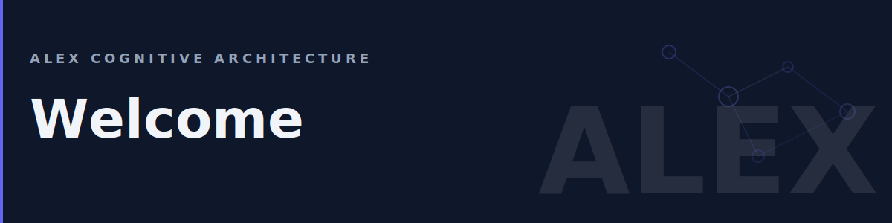

# Alex Cognitive Architecture



> **The most advanced and trusted AI partner for any job.**

Welcome to the Alex Cognitive Architecture Wiki — your comprehensive guide to working with Alex in VS Code.

## Quick Navigation

| Section | Description |
|---------|-------------|
| **[Getting Started](Getting-Started)** | First-time setup and configuration |
| **[User Manual](User-Manual)** | Commands, UI, and daily usage |
| **[MCP Server](MCP-Server)** | Use Alex tools from Claude Desktop, Cline, and other MCP clients |
| **[Heir Project Setup](Heir-Project-Setup)** | Configure Alex for your projects |
| **[FAQ](FAQ)** | Frequently asked questions |

## What is Alex?

Alex is a cognitive learning partner that lives in VS Code. Unlike traditional AI assistants that respond to prompts, Alex:

- **Remembers** — Maintains context across sessions through connections and episodic memory
- **Learns** — Improves through meditation, dreams, and self-actualization
- **Adapts** — Detects your project type and adjusts behavior accordingly
- **Partners** — Works alongside you, not just for you

## The Universal Creative Loop

Alex understands that all creative work follows the same pattern:

```
IDEATE → PLAN → BUILD/CREATE → TEST → RELEASE → IMPROVE
```

Whether you're writing code, a dissertation, or a business plan, Alex meets you where you are in the loop.

## Key Concepts

| Concept | Description |
|---------|-------------|
| **Connections** | Learned connections between concepts — Alex's long-term memory |
| **Episodic Memory** | Records of significant sessions and decisions |
| **Skills** | Specialized knowledge domains (195 available) |
| **Instructions** | Behavior rules that auto-activate based on file context (167 available) |
| **Muscles** | Executable scripts that enforce and validate |
| **Prompts** | Reusable workflow templates (41 available) |
| **Agents** | Specialized personas for different tasks (22 available) |
| **Heir Projects** | Your projects that inherit Alex's cognitive architecture |

## Health & Maintenance

Alex needs periodic maintenance to stay healthy:

| Process | Purpose | When |
|---------|---------|------|
| **Dream** | Validate and repair connections | Weekly or when prompted |
| **Meditate** | Consolidate recent learning | After major sessions |
| **Self-Actualize** | Comprehensive architecture assessment | Monthly |

## Getting Help

- **In VS Code**: Type `@alex` in chat for any question
- **GitHub Issues**: [Report bugs or request features](https://github.com/fabioc-aloha/alex-cognitive-architecture/issues)
- **This Wiki**: Browse the sidebar for detailed guides

---

*For Alex, code is just an artifact, not the final product.*
