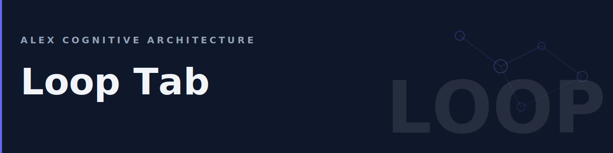

# Loop Tab



The Loop tab is your primary workspace in the Alex sidebar. It provides one-click access to guided workflows for every phase of software development — from ideation through release and beyond.

## Table of Contents

- [Overview](#overview)
- [Health Pulse](#health-pulse)
- [Chat with Alex](#chat-with-alex)
- [Creative Loop](#creative-loop)
- [Build Helpers](#build-helpers)
- [Research and Learn](#research-and-learn)
- [Communicate](#communicate)
- [Project Health](#project-health)
- [Dynamic Configuration](#dynamic-configuration)
- [Project Detection](#project-detection)
- [Project Phases](#project-phases)
- [Skill Contributions](#skill-contributions)
- [Frecency Sorting](#frecency-sorting)
- [How Buttons Work](#how-buttons-work)
- [Customizing Prompts](#customizing-prompts)
- [FAQ](#faq)

---

## Overview

The Loop tab contains:

1. **Health Pulse** — A live status widget showing your brain's health
2. **Chat with Alex** — Primary call-to-action to start a conversation
3. **Five collapsible groups** — 28+ guided workflows organized by category

Each button opens Copilot Chat with a pre-written prompt that guides Alex through a specific task. You don't need to remember commands or write detailed prompts — just click and go.

The Loop tab is fully config-driven. Its content comes from `.github/config/loop-menu.json`, with additional buttons injected by skills and filtered by your current project phase. You can customize everything without touching extension code.

---

## Health Pulse

The health pulse widget sits at the top of the Loop tab. It gives you an at-a-glance view of your cognitive architecture's health.

### Status Levels

| Status | Indicator | Meaning |
|--------|-----------|---------|
| **Healthy** | Green dot | Architecture is current and validated |
| **Attention** | Yellow dot | Dream overdue or minor sync issues |
| **Critical** | Red dot | 14+ days since dream, or major issues detected |
| **Unknown** | Gray dot | No dream has been run yet |

### What It Shows

- **Status label** — Healthy, Attention, Critical, or Unknown
- **Last Dream** — How long since the last dream cycle (e.g., "2 hours ago")
- **Inventory** — Count of skills, instructions, prompts, and agents in your workspace
- **Nudges** — Actionable suggestions when something needs attention

### Nudges

When Alex detects an issue, a clickable nudge appears below the status:

| Nudge | When | Action |
|-------|------|--------|
| "Run a dream to establish baseline" | No dream ever run | Click to run dream |
| "Dream overdue — architecture may have drifted" | 14+ days since dream | Click to run dream |
| "Sync may be stale" | Heir files older than master | Click to run dream |

### Buttons

| Button | What It Does |
|--------|-------------|
| **Dream** | Runs the dream protocol (architecture validation and repair) |
| **Refresh** | Reloads the health data without running a full dream |

---

## Chat with Alex

The primary indigo button at the top opens Copilot Chat with Alex ready to help. This is the fastest way to start any conversation — no prompt template, just a blank chat.

---

## Creative Loop

The Creative Loop is a six-phase development cycle. The phases are always shown in order (1 through 6) — they represent a natural workflow progression.

| Phase | Button | Icon | What It Does |
|-------|--------|------|-------------|
| 1 | **Ideate** | Lightbulb | Scaffold a project wiki and explore your idea. Alex helps brainstorm, evaluate feasibility, research prior art, and structure the concept. |
| 2 | **Plan** | Tree | Break the idea into actionable tasks. Alex creates architecture plans, task breakdowns, milestones, and technical specifications. |
| 3 | **Build** | Tools | Start implementing. Alex pairs with you on code — writing features, creating components, and following your project conventions. |
| 4 | **Test** | Beaker | Validate the implementation. Alex writes tests, reviews coverage, identifies edge cases, and runs test-driven development workflows. |
| 5 | **Release** | Rocket | Prepare for deployment. Alex handles changelogs, version bumps, release notes, packaging, and publishing workflows. |
| 6 | **Improve** | Sparkle | Iterate on what shipped. Alex analyzes feedback, identifies improvements, refactors technical debt, and plans the next cycle. |

### How to Use the Creative Loop

The loop is designed as a progression but you can jump to any phase. Working on a mature project? Start at **Build** or **Test**. Just shipped? Click **Improve** to plan what's next.

Each button opens a conversation with a detailed prompt template that guides Alex through that phase. You can follow the template or take the conversation in your own direction.

---

## Build Helpers

Focused tools for everyday coding tasks. This group starts collapsed — click the header to expand it.

| Button | Icon | What It Does |
|--------|------|-------------|
| **Review** | Code | Three-pass code review with confidence scoring. Alex reviews for correctness, style, and architecture in separate passes. |
| **Refactor** | Pull Request | Safe refactoring with behavior preservation. Alex identifies improvement opportunities and executes them systematically. |
| **Debug** | Bug | Systematic debugging procedure. Alex helps reproduce, isolate, hypothesize, and fix — following the scientific method. |
| **TDD** | Checklist | Test-driven development workflow. Alex writes failing tests first, then implements the minimum code to pass. |
| **Diagram** | Class | Generate Mermaid diagrams for architecture, data flow, sequence, or state machines from your code or descriptions. |
| **Gap Analysis** | Search | Identify missing features, incomplete implementations, or coverage gaps in your project. |

---

## Research and Learn

Tools for learning new domains and conducting research.

| Button | Icon | What It Does |
|--------|------|-------------|
| **Learn** | Graduation Cap | Socratic method learning session. Alex teaches through questions, building understanding layer by layer instead of dumping information. |
| **Research** | Telescope | Deep domain research with structured output. Alex investigates a topic, evaluates sources, and produces an organized knowledge base. |
| **Analyze Data** | Graph | Data analysis workflow. Alex profiles data, explores distributions, finds patterns, and translates findings into narrative insights. |
| **Literature** | Book | Literature review and synthesis. Alex searches for relevant papers, summarizes findings, identifies gaps, and creates annotated bibliographies. |

---

## Communicate

Tools for professional communication and presentation.

| Button | Icon | What It Does |
|--------|------|-------------|
| **Presentation** | Media | Structure and draft slides for any audience. Alex creates presentation outlines, talking points, and speaker notes adapted to your audience level. |
| **Data Story** | File Code | Turn data into narrative. Alex combines analysis with storytelling to create compelling data-driven reports. |
| **Meeting Notes** | Note | Structured meeting documentation. Alex helps create agendas, capture decisions, track action items, and distribute notes. |
| **Write Email** | Mail | Professional email drafting. Alex composes emails with appropriate tone, structure, and calls to action for any audience. |

---

## Project Health

Tools for maintaining project quality over time. These are especially useful for established projects.

| Button | Icon | What It Does |
|--------|------|-------------|
| **North Star** | Star | Define or check alignment with your project vision. Alex helps articulate goals and verify that current work supports them. |
| **Health Check** | Pulse | Full project health assessment. Alex evaluates code quality, documentation, test coverage, and architectural integrity. |
| **Doc Audit** | Book | Find stale, missing, or inaccurate documentation. Alex scans docs for drift and generates fix recommendations. |
| **Security** | Shield | Security review following OWASP Top 10 and STRIDE. Alex audits code for vulnerabilities and recommends mitigations. |
| **Tech Debt** | Trash | Identify and prioritize technical debt. Alex catalogs TODO/FIXME markers, code smells, and architecture issues. |
| **Dependencies** | Refresh | Dependency health check. Alex audits versions, finds vulnerabilities, identifies update opportunities, and flags breaking changes. |
| **Responsible AI** | Heart | Responsible AI review. Alex checks for bias, privacy concerns, content safety, and ethical alignment in AI-powered features. |
| **SFI Review** | Verified | Secure Futures Initiative compliance check. Alex evaluates against Microsoft's security and trust framework. |

---

## Customize for This Project

The Loop tab includes a **Customize for This Project** button (paintcan icon) in the **WORKSPACE** group at the bottom of the sidebar. Clicking it launches a guided wizard in Copilot Chat that walks you through:

1. **Taglines** — Add project-specific taglines that rotate in the sidebar header
2. **Loop groups** — Add new button groups tailored to your workflow (e.g., Brain Ops, Rituals, CI/CD)
3. **Buttons** — Add, remove, or rearrange buttons within any group
4. **Icons and labels** — Choose from VS Code Codicon icons and set descriptive labels

The wizard reads your current `loop-menu.json` and `taglines.json`, asks what you want to change, and writes the updates for you. No manual JSON editing required.

You can also run the wizard anytime by typing in Copilot Chat:

```
@alex /customize-welcome
```

---

## Dynamic Configuration

The Loop tab is config-driven. Instead of hardcoded buttons, the entire layout comes from `.github/config/loop-menu.json`. This means:

- You can add, remove, or reorder buttons by editing JSON
- Skills can inject their own buttons (see [Skill Contributions](#skill-contributions))
- Buttons can be filtered by project phase (see [Project Phases](#project-phases))
- Project-type-specific groups appear automatically (see [Project Detection](#project-detection))

### The Config File

The source of truth is `.github/config/loop-menu.json`. It defines groups and buttons:

```json
{
  "$schema": "./loop-config.schema.json",
  "version": "1.0",
  "groups": [
    {
      "id": "creative-loop",
      "label": "CREATIVE LOOP",
      "icon": "sync",
      "desc": "The universal creative cycle",
      "collapsed": false,
      "buttons": [
        {
          "id": "ideate",
          "icon": "lightbulb",
          "label": "Ideate",
          "command": "openChat",
          "promptFile": "ideate.prompt.md",
          "hint": "chat",
          "tooltip": "Brainstorm and explore ideas"
        }
      ]
    }
  ]
}
```

### Adding a Button

Add a new entry to any group's `buttons` array:

```json
{
  "id": "my-action",
  "icon": "zap",
  "label": "My Custom Action",
  "command": "openChat",
  "promptFile": "my-action.prompt.md",
  "hint": "chat",
  "tooltip": "What this action does"
}
```

Then create `.github/prompts/loop/my-action.prompt.md` with your prompt template.

### Removing a Button

Delete the button entry from the JSON. The prompt file can stay (harmless) or be removed.

### Config Validation

A JSON Schema is provided at `.github/config/loop-config.schema.json`. VS Code validates the config inline when the `$schema` field is set, highlighting errors as you type.

### Live Reload

The extension watches `loop-menu.json` for changes. Save the file and the sidebar updates automatically — no reload needed.

---

## Project Detection

When Alex initializes a workspace (via the **Initialize** command or the heir bootstrap), it automatically detects your project type and generates a tailored `loop-menu.json`.

### Supported Project Types

| Type | Detected By | Extra Groups |
|------|------------|--------------|
| **vscode-extension** | `vsc-extension-quickstart.md` or `vscode` in package.json engines | Extension Dev (package, publish, debug, test) |
| **python-api** | `requirements.txt`, `pyproject.toml`, or `setup.py` with FastAPI/Flask | Python API (run server, format, type check, migrate) |
| **data-pipeline** | Notebooks, Fabric/Synapse files, or delta tables | Data Pipeline (notebook, pipeline, data quality) |
| **static-site** | VitePress, Hugo, Jekyll, or Gatsby config files | Static Site (dev server, build, deploy, content) |
| **monorepo** | `packages/` or `apps/` directories with workspace config | Monorepo (workspace commands, cross-package) |
| **generic** | Default fallback | None — core groups only |

### What Gets Generated

The config generator produces a `loop-menu.json` that includes:

1. The five universal groups (Creative Loop, Build Helpers, Research & Learn, Communicate, Project Health)
2. Project-type-specific groups appended at the end
3. A `projectContext` section with detected build/test/lint commands and technology stack
4. A default `projectPhase` of `active-development`

### Regenerating the Config

To regenerate after significant project changes, delete `loop-menu.json` and run **Initialize** again, or ask Alex:

```
@alex regenerate my loop-menu.json based on the current workspace
```

---

## Project Phases

Buttons and groups can be tagged with lifecycle phases. When a project phase is set, the Loop tab shows only the items relevant to what you're doing right now.

### The Five Phases

| Phase | Focus | Example Buttons Highlighted |
|-------|-------|---------------------------|
| **planning** | Architecture and design | Ideate, Plan, Research, North Star |
| **active-development** | Building features | Build, Debug, Review, TDD, Refactor |
| **testing** | Validation and QA | Test, Security, Health Check, Gap Analysis |
| **release** | Ship and publish | Release, Dependencies, Doc Audit |
| **maintenance** | Long-term health | Improve, Tech Debt, Dependencies, Responsible AI |

### Setting the Phase

Use the command palette:

1. Press `Ctrl+Shift+P`
2. Type "Alex: Set Project Phase"
3. Select your current phase

The phase is saved in `loop-menu.json` and persists across sessions.

### How Phase Filtering Works

- Buttons with a `phase` array only appear when the current phase matches
- Buttons without a `phase` field always appear (phase-agnostic)
- Groups whose phase matches are auto-expanded; others stay collapsed
- If no phase is set, all buttons appear (backward compatible)

### Phase Tags in Config

Groups and buttons can have a `phase` array in `loop-menu.json`:

```json
{
  "id": "release-prep",
  "label": "RELEASE PREP",
  "phase": ["release"],
  "buttons": [
    {
      "id": "changelog",
      "label": "Changelog",
      "phase": ["release", "maintenance"],
      "command": "openChat",
      "promptFile": "changelog.prompt.md"
    }
  ]
}
```

---

## Skill Contributions

Skills can add their own buttons to the Loop tab by including a partial config file. This allows the Loop tab to grow organically as you install skills — without editing the main config.

### How It Works

1. A skill includes a file at `.github/skills/{skill-name}/loop-config.partial.json`
2. When the Loop tab loads, Alex scans all skill directories for these partials
3. Partial buttons are merged into matching groups (by `id`) or added as new groups
4. Skill-contributed buttons appear alongside core buttons, tagged with `source: "skill"`

### Partial Config Format

```json
{
  "groups": [
    {
      "id": "build-helpers",
      "buttons": [
        {
          "id": "my-skill-action",
          "icon": "beaker",
          "label": "My Skill Action",
          "command": "openChat",
          "promptFile": "my-skill-action.prompt.md",
          "hint": "chat",
          "tooltip": "What this skill-contributed button does"
        }
      ]
    }
  ]
}
```

### Merge Rules

- If the partial's group `id` matches an existing group, new buttons are **appended** to that group (duplicates by `id` or `label` are skipped)
- If the group `id` doesn't match, a new group is added at the end
- Skill partials never remove or replace existing buttons — they only extend

### Creating a Skill Partial

1. Create `.github/skills/my-skill/loop-config.partial.json`
2. Define groups and buttons using the same schema as `loop-menu.json`
3. Create the referenced `.prompt.md` files in `.github/prompts/loop/`
4. Save — the sidebar picks up changes automatically via file watcher

---

## Frecency Sorting

Buttons within each group (except Creative Loop) are automatically reordered based on your usage patterns. The algorithm combines **frequency** (how often you click a button) and **recency** (how recently you clicked it) with a 7-day half-life.

This means:

- Buttons you use daily float to the top
- Buttons you haven't used in weeks drift to the bottom
- A button used once today ranks higher than one used five times last month

The Creative Loop always maintains its 1-through-6 order because the sequence is intentional.

Frecency data is stored in VS Code's global state and persists across sessions and window reloads.

---

## How Buttons Work

Every button in the Loop tab sends a message to Alex with one of three behaviors, indicated by a badge on hover:

| Badge | Behavior | What Happens |
|-------|----------|-------------|
| **Chat** (speech bubble) | Opens Copilot Chat with a pre-written prompt | The prompt is auto-submitted and Alex starts working |
| **Command** (lightning bolt) | Runs a VS Code command | Direct action — no chat involved |
| **Link** (chain) | Opens a URL in your browser | External navigation |

Most Loop tab buttons are **Chat** type. They load a prompt template from `.github/prompts/loop/` and send it to Copilot Chat. Some prompts end with `: ` — these open the chat with the prompt pre-filled but wait for you to finish typing before submitting.

---

## Customizing Prompts

Every Loop tab button is backed by a prompt template file. You can customize these for your project.

### Where Prompts Live

Prompt templates are at `.github/prompts/loop/*.prompt.md`. Each file has YAML frontmatter and a markdown body:

```markdown
---
mode: agent
description: "Code review with three-pass analysis"
tools: ["codebase", "terminal"]
---

Review the code changes in the current file or selection.

## Procedure

1. **Correctness pass** — Does it work?
2. **Style pass** — Does it follow conventions?
3. **Architecture pass** — Does it fit the design?

Provide confidence scores for each pass.
```

### Modifying a Prompt

1. Open the prompt file (e.g., `.github/prompts/loop/review.prompt.md`)
2. Edit the markdown body — this becomes what Alex receives when you click the button
3. Save — changes take effect on the next click (or click **Refresh** in the sidebar)

### Prompt Caching

Prompt templates are loaded once per session and cached. If you edit a prompt file, click the **Refresh** button (or reload the sidebar) to pick up changes. Edits to `.github/prompts/loop/` are also watched — the sidebar refreshes automatically on save.

---

## FAQ

### Which button should I start with?

If you're starting a new project, begin with **Ideate** in the Creative Loop. For existing projects, **Health Check** or **Review** are good entry points. For learning something new, try **Learn**.

### Why are my buttons in a different order?

Buttons reorder based on your usage patterns (frecency). The more you use a button, the higher it appears in its group. Creative Loop is the exception — it always stays in 1-6 order.

### Can I reset button ordering?

Frecency data is stored in VS Code global state. To reset, run the command palette (`Ctrl+Shift+P`) and search "Developer: Reset User Data" — but this resets all VS Code state, not just Alex. There is no button-specific reset.

### What if a prompt template is missing?

The button still works — it opens Copilot Chat without a pre-filled prompt. You'll need to type your own message. Create the missing `.prompt.md` file to restore the guided behavior.

### How do I collapse/expand groups?

Click the group header (e.g., "BUILD HELPERS"). The collapsed state is saved — groups stay collapsed or expanded across sessions.

### Where is the config file?

`.github/config/loop-menu.json` in your workspace root. Edit it directly or use Alex to regenerate it based on your project type.

### How do I add project-type-specific buttons?

Either regenerate the config (delete `loop-menu.json` and re-initialize), or add groups manually to the JSON. Use the `source` field to tag groups as `"type"` for project-specific or `"skill"` for skill-contributed.

### What happens if I change project phase?

Buttons tagged with `phase` arrays are filtered. Only buttons matching the current phase (or those without a phase tag) appear. Groups whose phase matches auto-expand. Change phase anytime via `Ctrl+Shift+P` then "Alex: Set Project Phase".

### Can skills break my Loop tab?

No. Skill partials only append — they never remove or override existing buttons. If a skill partial has invalid JSON, it is silently skipped and the core config loads normally.

---

*Need help with a specific workflow? Ask Alex: `@alex help me with [workflow name]`*
