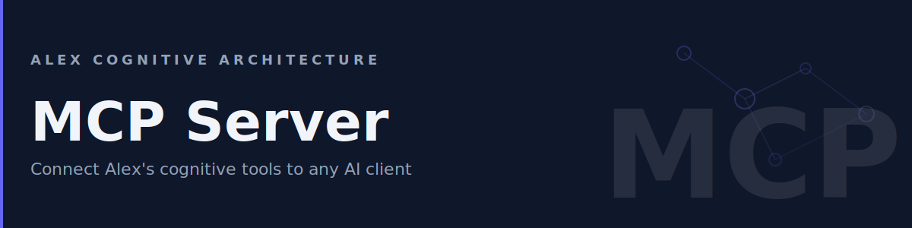

# MCP Server



Connect Alex's cognitive tools to any AI client.

Alex ships a standalone **Model Context Protocol (MCP)** server that lets any MCP-compatible AI client access Alex's cognitive tools.

If you use Claude Desktop, Cline, Continue, Windows Copilot, or any other tool that supports MCP, you can connect it to Alex without installing the VS Code extension.

## What is MCP?

The [Model Context Protocol](https://modelcontextprotocol.io/) is an open standard that lets AI applications call external tools. Think of it as a universal plug that connects any AI host to any tool provider.

Alex's MCP server exposes five cognitive tools, four prompt templates, and browseable architecture documents.

## Installation

The MCP server ships with the Alex repo. Build it once, then point your MCP client at the compiled output.

```bash
cd heir/platforms/mcp-cognitive-tools
npm install
npm run build
```

The server entry point is `heir/platforms/mcp-cognitive-tools/dist/index.js`.

### Requirements

- **Node.js 18+**
- An Alex workspace with `.github/` (for workspace-specific tools)
- AI-Memory folder for global knowledge features (auto-detected in OneDrive, iCloud, Dropbox, or `~/.alex/AI-Memory/`)

## Client Configuration

### VS Code

Add to your workspace `.vscode/mcp.json`:

```json
{
  "servers": {
    "alex-cognitive": {
      "type": "stdio",
      "command": "node",
      "args": ["${workspaceFolder}/heir/platforms/mcp-cognitive-tools/dist/index.js"]
    }
  }
}
```

### Claude Desktop

Add to `claude_desktop_config.json` (use the absolute path to your repo):

```json
{
  "mcpServers": {
    "alex-cognitive": {
      "command": "node",
      "args": ["/path/to/alex-cognitive-architecture/heir/platforms/mcp-cognitive-tools/dist/index.js"]
    }
  }
}
```

### Cline / Continue

```json
{
  "mcp": {
    "servers": {
      "alex-cognitive": {
        "command": "node",
        "args": ["/path/to/alex-cognitive-architecture/heir/platforms/mcp-cognitive-tools/dist/index.js"]
      }
    }
  }
}
```

## Tools

The MCP server exposes five tools that any connected AI client can call.

### alex_health_check

Check the health of Alex's cognitive architecture. Validates that skills, instructions, and prompts are properly installed.

| Parameter | Type | Required | Description |
|-----------|------|----------|-------------|
| `workspacePath` | string | No | Path to workspace (defaults to cwd) |

Returns status (`EXCELLENT`, `GOOD`, or `NEEDS_ATTENTION`), component counts, and broken synapse details.

### alex_memory_search

Search across all of Alex's memory systems — skills, instructions, prompts, episodic memory, and global knowledge.

| Parameter | Type | Required | Description |
|-----------|------|----------|-------------|
| `query` | string | Yes | Search query |
| `memoryType` | string | No | `all`, `skills`, `instructions`, `prompts`, `episodic`, or `global` |
| `limit` | number | No | Max results (default: 10) |

Returns matching files with type, name, path, and content snippet.

### alex_architecture_status

Get the current inventory of cognitive components — how many skills, instructions, prompts, agents, and muscles are installed.

| Parameter | Type | Required | Description |
|-----------|------|----------|-------------|
| `workspacePath` | string | No | Path to workspace (defaults to cwd) |

### alex_knowledge_search

Search the global knowledge base for cross-project patterns and insights.

| Parameter | Type | Required | Description |
|-----------|------|----------|-------------|
| `query` | string | Yes | Search query |
| `category` | string | No | `patterns`, `insights`, or `all` |
| `limit` | number | No | Max results (default: 10) |

### alex_knowledge_save

Save a new insight to the global knowledge base so Alex can reference it across all projects.

| Parameter | Type | Required | Description |
|-----------|------|----------|-------------|
| `title` | string | Yes | Brief title |
| `content` | string | Yes | Full insight in Markdown |
| `category` | string | Yes | `architecture`, `patterns`, `debugging`, `best-practices`, or `lessons-learned` |
| `tags` | string[] | No | Tags for discoverability |

## Prompt Templates

MCP prompts appear as slash commands in VS Code chat (e.g., `/mcp.alex-cognitive-tools.health-check`).

| Prompt | Description |
|--------|-------------|
| `health-check` | Run a cognitive architecture health check |
| `architecture-overview` | Summarize the architecture in this workspace |
| `search-knowledge` | Search for patterns, insights, or prior learnings |
| `save-insight` | Save a new insight to the global knowledge base |

## Resources

Architecture documents are exposed as browseable MCP resources. In VS Code, attach them via **Add Context > MCP Resources**.

| Resource | Description |
|----------|-------------|
| North Star | Project vision and mission |
| Cognitive Architecture | Full architecture documentation |
| Conscious Mind | Always-on instruction set |
| What is Alex | Architecture overview for newcomers |

## Troubleshooting

### Tools return empty results

The workspace-specific tools (`alex_health_check`, `alex_memory_search`, `alex_architecture_status`) require a `.github/` directory in the workspace. If you're running outside an Alex workspace, only the global knowledge tools will work.

### "Cannot find module" error

Make sure Node.js 18+ is installed:

```bash
node --version
```

Rebuild and retry:

```bash
cd heir/platforms/mcp-cognitive-tools
npm run build
node dist/index.js
```

### Knowledge tools return nothing

Global knowledge tools look for the AI-Memory folder in these locations (in order):

1. OneDrive: `~/OneDrive/AI-Memory/` or `~/OneDrive - Microsoft/AI-Memory/`
2. iCloud: `~/Library/Mobile Documents/com~apple~CloudDocs/AI-Memory/`
3. Dropbox: `~/Dropbox/AI-Memory/`
4. Fallback: `~/.alex/AI-Memory/`

If none exist, create `~/.alex/AI-Memory/` manually.

### Server won't start

Check that no other process is using stdio on the same channel. MCP servers communicate via stdin/stdout — running two instances simultaneously will conflict.
