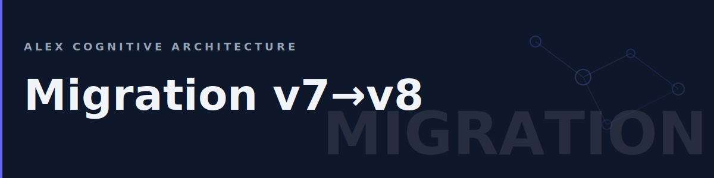

# Migration Guide: v7 → v8

This guide covers upgrading from Alex v7.x to v8.0.0.

## What Changed

v8.0.0 is a clean-room rebuild. The extension code is entirely new, but your brain files and workflow are fully compatible.

| Area | v7 | v8 |
|------|----|----|
| **Build system** | webpack | esbuild |
| **Terminology** | "Neural", "Synapse" | "Architecture", "Connection" |
| **Architecture model** | Skill + Instruction + Prompt | Skill + Instruction + Muscle (trifecta) |
| **Sidebar** | Single panel | 3-tab (Loop, Autopilot, Setup) |
| **Health monitoring** | Manual checks | Automatic Health Pulse |
| **CLI tools** | Imported from extension | Standalone scripts |
| **Scheduled tasks** | Not available | Autopilot v1 |
| **Extension name** | `alex-vscode-extension` | `alex-cognitive-architecture` |

## Upgrade Steps

### 1. Update the Extension

Update from the VS Code Marketplace or install the new version:

1. Open Extensions panel (`Ctrl+Shift+X`)
2. Search for "Alex Cognitive Architecture"
3. Click **Update** (or **Install** if switching from the old extension)

If you had the old `alex-vscode-extension`, uninstall it first — the new extension uses a different identifier.

### 2. Update Brain Files

Run **Alex: Upgrade Architecture** from the Command Palette (`Ctrl+Shift+P`) to get the latest brain files. This updates your `.github/` directory with v8 skills, instructions, and prompts.

### 3. Terminology in Custom Files

If you created custom instructions or skills that reference the old terminology, update them:

| Old Term | New Term |
|----------|----------|
| `synapse` | `connection` |
| `neural maintenance` | `architecture maintenance` |
| `neural network` (when referring to brain) | `cognitive architecture` |

Your custom files will still work with old terminology — this is a cosmetic update.

### 4. Custom copilot-instructions.md

If you customized `copilot-instructions.md`, the v8 format has changed:

- **v7**: Identity-heavy with detailed persona sections
- **v8**: Lean format focused on routing, safety imperatives, and project context

The brain update preserves your file if it already exists. To adopt the v8 format, back up your current file and run the brain install. Then merge any project-specific sections back in.

### 5. Trifecta Model

The capability model changed from **skill + instruction + prompt** to **skill + instruction + muscle**:

- **Skills**: Domain knowledge (unchanged)
- **Instructions**: Auto-loaded behavior rules (unchanged)
- **Muscles**: Automation scripts that enforce/validate (new role)
- **Prompts**: Now optional — for discoverability via sidebar buttons

No action needed. Your existing skills and instructions work as before.

## Breaking Changes

| Change | Impact | Action |
|--------|--------|--------|
| Extension ID changed | Marketplace identity | Install new, uninstall old |
| `alex-vscode-extension` → `alex-cognitive-architecture` | Settings namespace unchanged (`alex.*`) | None |
| Webpack removed | Build pipeline | Only affects contributors |
| CLI tools standalone | `dream-cli`, `pptxgen-cli` | Update any custom scripts that called these |

## Verification

After upgrading, verify everything works:

1. Open the Alex sidebar — you should see 2 tabs (Loop, Setup)
2. Check the Loop tab — Health Pulse should show "Healthy"
3. Run a Dream cycle (`Alex: Dream`) — should complete without errors
4. Open Copilot Chat — `@alex` should respond normally

## Rollback

If you need to revert:

1. Install the previous version: `code --install-extension fabioc-aloha.alex-vscode-extension-7.9.0.vsix`
2. Your brain files in `.github/` are backward-compatible — no changes needed

## Questions?

- [FAQ](FAQ)
- [GitHub Issues](https://github.com/fabioc-aloha/alex-cognitive-architecture/issues)
