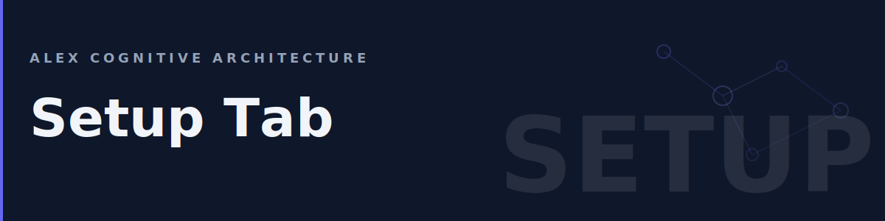

# Setup Tab

The Setup tab contains workspace management, brain health tools, memory access, extension settings, and documentation links. It's the place to go for configuring Alex, running maintenance, and accessing your personal AI memory.

## Table of Contents

- [Overview](#overview)
- [Workspace](#workspace)
- [Brain Status](#brain-status)
- [User Memory](#user-memory)
- [Environment](#environment)
- [Learn](#learn)
- [About](#about)
- [FAQ](#faq)

---

## Overview

The Setup tab has six groups:

| Group | Purpose | Default State |
|-------|---------|--------------|
| **Workspace** | Initialize and upgrade your project | Expanded |
| **Brain Status** | Health maintenance and cognitive processes | Expanded |
| **User Memory** | Access memory files, agents, prompts, and MCP config | Collapsed |
| **Environment** | Extension settings | Collapsed |
| **Learn** | Documentation and support links | Collapsed |
| **About** | Version, publisher, and license info | Collapsed |

---

## Workspace

Tools for setting up and maintaining your project's cognitive architecture.

### Initialize Workspace

Installs Alex's brain files (skills, instructions, prompts, and muscles) into your project's `.github/` directory. This is the first thing to run when setting up a new heir project.

**What it does:**

1. Copies the core brain files from the extension into your workspace
2. Creates `.github/skills/`, `.github/instructions/`, `.github/prompts/`, and `.github/muscles/` directories
3. Scaffolds a `copilot-instructions.md` file if one doesn't exist
4. Respects existing files — won't overwrite your customizations

**When to use:** First time setting up Alex in a new workspace, or after a fresh clone of a project that should have Alex files.

**Important:** Never run Initialize on a Master Alex workspace — it would overwrite the source-of-truth brain files. The extension includes a safety check for this.

### Upgrade Architecture

Updates your project's brain files to the latest version. This brings in new skills, updated instructions, and improved prompts from the latest extension release.

**What it does:**

1. Compares your workspace brain files against the extension's bundled version
2. Updates changed files while preserving your project-specific customizations
3. Reports what was added, updated, or unchanged

**When to use:** After updating the Alex extension to a new version, or when prompted by a health check nudge.

---

## Brain Status

Cognitive health maintenance and deep self-assessment tools.

### Run Dream Protocol

The dream protocol is Alex's primary maintenance process. It validates the entire cognitive architecture, detects issues, and repairs what it can.

**What it does:**

- Validates all architecture connections between skills and instructions
- Checks file integrity and frontmatter syntax
- Detects drift between workspace files and expected state
- Produces a health report with inventory counts and issue list
- Repairs minor issues automatically

**When to use:** Regularly — at least once a week. The Health Pulse widget in the Loop tab will show "Attention" or "Critical" when a dream is overdue. You can also trigger it with `@alex dream` in chat.

### Meditate

A knowledge consolidation session. Unlike the automated dream protocol, meditation is a conversational process where Alex reflects on recent work and strengthens understanding.

**What it does:**

- Reviews recent commits and file changes
- Identifies patterns and insights from the current session
- Consolidates learned knowledge into memory
- Strengthens connections between related concepts

**When to use:** After completing a significant piece of work, after a long coding session, or when you want Alex to "absorb" what you've been doing.

**How it works:** Clicking Meditate opens Copilot Chat with a meditation prompt. Alex walks through the consolidation process conversationally — you can participate or let it work.

### Self-Actualize

A deep self-assessment and growth planning session. This is Alex's most comprehensive introspective process.

**What it does:**

- Evaluates architecture completeness across all dimensions
- Identifies growth areas and missing capabilities
- Compares current state against the North Star vision
- Plans improvements and prioritizes next steps
- Assesses cognitive health holistically

**When to use:** Periodically for strategic review, or when you want to understand the full state of the architecture and plan improvements.

---

## User Memory

Quick access to all of your persistent AI memory locations. These are the files and folders that shape how Alex (and other Copilot-powered tools) remember your preferences, patterns, and context.

### Memories

Opens the VS Code Copilot memory folder in your file explorer. This is where persistent user memories are stored — notes that survive across all workspaces and conversations.

**Location:** `%APPDATA%/Code/User/globalStorage/github.copilot-chat/memory-tool/memories`

**What's inside:** Markdown files that Alex creates and reads automatically. Topics like debugging patterns, project preferences, and recurring solutions live here.

### Custom Agents

Opens the user-level custom agents folder. These are `.agent.md` files that define specialized AI personas available in all your workspaces.

**Location:** `~/.copilot/agents/`

**What's inside:** Agent definitions with personality, expertise, and instruction overrides.

### User Instructions

Opens the user-level instructions folder. These are `.instructions.md` files that apply across all your workspaces — your personal coding standards, preferences, and rules.

**Location:** `~/.copilot/instructions/`

**What's inside:** Always-active instructions like code quality rules, communication preferences, and security guidelines.

### User Prompts

Opens the reusable prompt templates folder. These are `.prompt.md` files that appear in the Copilot Chat prompt picker.

**Location:** `%APPDATA%/Code/User/prompts`

**What's inside:** Prompt templates you've created or that Alex has installed. You can create new ones here to add custom workflows.

### MCP Config

Opens the Model Context Protocol server configuration file in the editor. MCP servers extend Alex's capabilities with external tools and data sources.

**Location:** `%APPDATA%/Code/User/mcp.json`

**What's inside:** JSON configuration for MCP servers — GitHub, Azure, databases, and other integrations. Edit this to add or configure MCP tool servers.

### Copilot Memory (GitHub)

Opens the GitHub Copilot memory management page in your browser. This is the cloud-synced memory that Copilot uses across all your devices.

**URL:** `https://github.com/settings/copilot`

**What you can do:** View, edit, and delete memories that Copilot has stored about you. Useful for correcting outdated information or removing sensitive data.

---

## Environment

### Extension Settings

Opens VS Code settings filtered to Alex-specific configuration options. All settings are prefixed with `alex.`.

**Available settings include:**

| Setting | Description |
|---------|-------------|
| `alex.verbosity` | Response length preference (`brief`, `standard`, `detailed`) |
| Other settings | Vary by extension version — check the settings page for the full list |

---

## Learn

Documentation and support links.

### Open Wiki

Opens the full Alex documentation wiki in your browser. The wiki covers everything from getting started to advanced architecture topics.

**URL:** [Alex Wiki](https://github.com/fabioc-aloha/alex-cognitive-architecture/wiki)

### Report an Issue

Opens the GitHub Issues page for bug reports, feature requests, and support questions.

**URL:** [GitHub Issues](https://github.com/fabioc-aloha/alex-cognitive-architecture/issues)

---

## About

Version and licensing information.

| Item | Description |
|------|-------------|
| **Version** | Current extension version number |
| **Publisher** | fabioc-aloha on GitHub |
| **License** | PolyForm Noncommercial 1.0.0 |

---

## FAQ

### When should I run Initialize vs Upgrade?

**Initialize** is for first-time setup — it installs the full brain from scratch. **Upgrade** is for existing projects — it updates brain files to the latest version while preserving your customizations. If unsure, run Upgrade; it's safe on already-initialized workspaces.

### What's the difference between Dream, Meditate, and Self-Actualize?

| Process | Speed | Scope | Interactive? |
|---------|-------|-------|-------------|
| **Dream** | Fast | File validation and repair | No — runs automatically |
| **Meditate** | Medium | Knowledge consolidation | Yes — conversational |
| **Self-Actualize** | Slow | Full architecture assessment | Yes — deep conversation |

Dream is maintenance. Meditate is learning. Self-Actualize is strategic planning.

### Where are my memories stored?

Multiple locations, each with a different scope:

| Location | Scope | Persistence |
|----------|-------|-------------|
| **User Memories** | All workspaces | Permanent until deleted |
| **Session Memory** | Current conversation | Cleared after session |
| **Copilot Memory (GitHub)** | All devices | Cloud-synced, permanent |
| **Workspace `.github/`** | This project | Version-controlled |

### Can I edit memory files directly?

Yes. User memories are plain markdown files. Open them via the **Memories** button, edit in any text editor, and save. Alex reads them on the next conversation. Be concise — these files are loaded into context automatically, so shorter is better.

### Is it safe to run Initialize on an existing project?

Yes. Initialize checks for existing files and won't overwrite your customizations. However, never run it on a Master Alex workspace (the source-of-truth repository) — a safety check prevents this.

### What does the MCP Config control?

MCP (Model Context Protocol) servers are external tools that Alex can call during conversations — GitHub API, Azure services, databases, etc. The `mcp.json` file defines which servers are available and how to connect to them.

---

*Need help with setup? Ask Alex: `@alex help me configure my workspace`*
