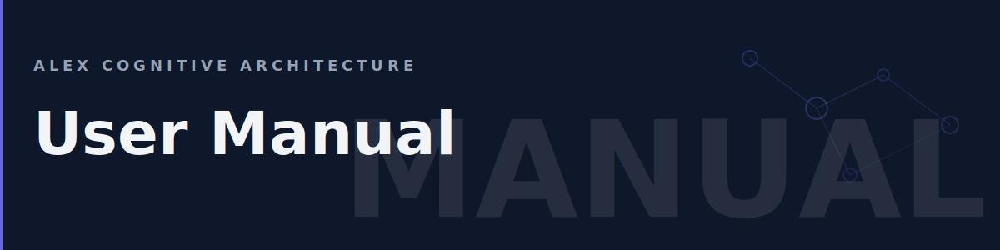

# User Manual



Complete reference for Alex commands, UI, and features.

## Table of Contents

- [Talking to Alex](#talking-to-alex)
- [Sidebar Panel](#sidebar-panel)
- [Loop Tab](Loop-Tab)
- [Setup Tab](Setup-Tab)
- [Agents](#agents)
- [Skills](#skills)
- [Memory System](#memory-system)
- [Health Processes](#health-processes)
- [Settings](#settings)
- [Advanced Syntax](#advanced-syntax)

---

## Talking to Alex

Open Copilot Chat (`Ctrl+Shift+I`) and talk naturally. Alex understands context and intent.

### Core Actions

| What You Want | What to Say |
|---------------|-------------|
| Get help | "What can you help me with?" |
| Check health | "What's your current status?" |
| Validate memory | "Run a dream to check your health" |
| Consolidate learning | "Let's do a meditation session" |
| Deep assessment | "I'd like to do a self-actualization" |

### Workspace Actions

| What You Want | What to Say |
|---------------|-------------|
| Set up workspace | "Initialize this workspace" |
| Reset settings | "Reset the workspace configuration" |
| Sync architecture | "Synchronize the heir architecture" |

### Switching Agents

Ask Alex to use a specific agent for specialized tasks:

```
Use the Builder agent to create a React component
```

```
Can you switch to Researcher mode? I need to learn about OAuth2
```

```
I need a code review — use the Validator agent
```

---

## Sidebar Panel

The Alex sidebar (`Ctrl+Shift+A` or click the Alex icon) contains three tabs:

### Loop Tab

Your primary workspace — guided workflows for every phase of development.

| Section | What It Does |
|---------|-------------|
| **Health Pulse** | Live status widget showing brain health (Healthy / Attention / Critical) |
| **Chat with Alex** | Primary button to open a conversation |
| **Creative Loop** | Six-phase development cycle: Ideate → Plan → Build → Test → Release → Improve |
| **Build Helpers** | Code review, refactoring, debugging, TDD, diagrams, gap analysis |
| **Research & Learn** | Socratic learning, deep research, data analysis, literature review |
| **Communicate** | Presentations, data stories, meeting notes, email drafting |
| **Project Health** | Vision alignment, health checks, doc audits, security, tech debt, dependencies |
| **Workspace** | Customize for This Project — launches a guided wizard to tailor taglines, groups, and buttons |

Buttons reorder automatically by usage frequency (frecency). The Loop tab is config-driven — its content adapts to your project type and lifecycle phase. See [Loop Tab](Loop-Tab) for full documentation.

### Autopilot Tab

> **Temporarily unavailable.** The Autopilot feature is being rebuilt. See [Autopilot](Autopilot) for reference documentation.

### Setup Tab

Workspace management, brain maintenance, memory access, and settings.

| Section | What It Does |
|---------|-------------|
| **Workspace** | Initialize or upgrade your cognitive architecture |
| **Brain Status** | Dream protocol, brain health check, skill validation, token cost report, meditation, and self-actualization |
| **Tools** | New skill scaffold, markdown lint, insight extraction |
| **User Memory** | Quick access to memories, prompts, and MCP config |
| **Environment** | Extension settings |
| **Learn** | Wiki and issue tracker links |
| **About** | Version, publisher, and license |

See [Setup Tab](Setup-Tab) for full documentation.

---

## Agents

Alex has 22 specialized agents for different tasks. Here are the most commonly used:

| Agent | Specialty | When to Use |
|-------|-----------|-------------|
| **Alex** | General partnership | Default, most conversations |
| **Builder** | Implementation | Writing code, creating features |
| **Researcher** | Exploration | Learning new domains, investigations |
| **Validator** | Quality assurance | Code review, testing, audits |
| **Planner** | Strategy | Architecture, roadmaps, planning |
| **Documentarian** | Documentation | READMEs, wikis, changelogs |
| **Presenter** | Communication | Demos, presentations, stakeholder docs |
| **Frontend** | UI development | React, TypeScript, design systems |
| **Backend** | API development | FastAPI, Pydantic, data services |
| **Infrastructure** | Cloud & IaC | Azure, Bicep, Container Apps |
| **Azure** | Azure services | Azure development with MCP tools |
| **Critical Thinker** | Analysis | High-stakes decisions, bias detection |
| **Image Studio** | Visual content | AI image generation via Replicate |
| **Audio Studio** | Audio content | Voice samples and TTS generation |
| **Brain Ops** | Maintenance | Cognitive architecture fleet management |
| **Skill Builder** | Skill creation | Building trifectas (skill + instruction + muscle) |
| **File Converter** | Format conversion | Document format routing |
| **M365** | Microsoft 365 | Teams and M365 Copilot development |

### Switching Agents

Ask Alex to use a specific agent:

```
Use the Builder agent to create a React component for user profiles
```

```
Switch to Researcher mode and investigate OAuth2 best practices
```

---

## Skills

Alex has 194 skills across domains. Skills activate automatically based on context.

### Skill Categories

| Category | Examples |
|----------|----------|
| **Development** | `vscode-extension-patterns`, `api-design`, `testing-strategies` |
| **AI/ML** | `prompt-engineering`, `rag-architecture`, `mcp-development` |
| **Documentation** | `markdown-mermaid`, `lint-clean-markdown`, `md-to-word` |
| **Quality** | `code-review`, `security-review`, `debugging-patterns` |
| **Process** | `release-process`, `git-workflow`, `scope-management` |

### Checking Active Skills

```
What skills are active for this workspace?
```

### Requesting a Skill

```
Use the security-review skill to audit this code
```

---

## Memory System

Alex maintains three types of memory:

### Connections (Long-term)

Learned connections between concepts. Created when Alex discovers patterns or relationships.

- Stored in `.github/connections/`
- Persist across sessions
- Strengthened through repeated use

### Episodic Memory (Session-based)

Records of significant sessions and decisions.

- Stored in `.github/episodic/`
- Captures key moments from conversations
- Used for context in future sessions

### User Memory (Copilot Chat)

Copilot Chat's memory about you, accessible to Alex.

- Cloud-synced across workspaces
- Contains preferences and patterns
- Managed via the Setup tab → User Memory, or say "Audit my user memory" in chat

---

## Health Processes

Alex needs maintenance to stay healthy. Run these periodically:

### Dream (Weekly)

Validates and repairs connection network.

**Ask:** "Run a dream to check your health"

**What it does:**
- Checks connection integrity
- Identifies broken connections
- Proposes repairs
- Reports health score

### Meditate (After major sessions)

Consolidates recent learning into long-term memory.

**Ask:** "Let's do a meditation session"

**What it does:**
- Reviews recent sessions
- Extracts key insights
- Creates new connections
- Updates skill activations

### Self-Actualize (Monthly)

Comprehensive architecture assessment.

**Ask:** "I'd like to do a self-actualization"

**What it does:**
- Full cognitive architecture audit
- Skill usage analysis
- Memory efficiency review
- Improvement recommendations

---

## File Converters

Alex includes 11 document converters accessible via right-click menus. Right-click any `.md`, `.docx`, `.html`, or `.pptx` file in the Explorer or editor tab to see conversion options.

| From | To |
|------|----|
| Markdown | HTML, Word, PDF, PowerPoint, EPUB, LaTeX, Email, Plain Text |
| Word | Markdown |
| HTML | Markdown |
| PowerPoint | Markdown |

All converters require **pandoc**. Mermaid diagrams are automatically rendered to images when `mermaid-cli` is installed.

See [File Converters](File-Converters) for the full reference including CLI flags, style presets, and troubleshooting.

---

## Settings

Configure Alex through VS Code settings (`Ctrl+,` → search "alex").

### Available Settings

| Setting | Default | Description |
|---------|---------|-------------|
| `alex.workspace.protectedMode` | `false` | Prevents brain operations that modify workspace files. Auto-enabled for Master Alex. |

### Settings File

Create `.vscode/settings.json` in your workspace:

```json
{
  "alex.workspace.protectedMode": true
}
```

---

## Keyboard Shortcuts

Alex uses standard VS Code shortcuts:

| Shortcut | Action |
|----------|--------|
| `Ctrl+Shift+I` | Open Copilot Chat (talk to Alex) |
| Click Alex icon in Activity Bar | Toggle Alex sidebar |

### Custom Shortcuts

Add to `keybindings.json`:

```json
{
  "key": "ctrl+alt+d",
  "command": "alex.dream",
  "when": "editorTextFocus"
}
```

---

## Advanced Syntax

For power users, Alex supports explicit command syntax. These are optional — natural language works just as well.

### @alex Prefix

In Copilot Chat, you can explicitly address Alex:

```
@alex What skills do you have?
```

This is useful when multiple participants are installed or you want to be explicit.

### Command Shortcuts

| Command | Description |
|---------|-------------|
| `@alex help` | List capabilities |
| `@alex status` | Show cognitive health |
| `@alex dream` | Run dream cycle |
| `@alex meditate` | Consolidate learning |
| `@alex self-actualize` | Deep assessment |
| `@alex initialize` | Set up workspace |
| `@alex reset` | Clear settings |
| `@alex sync` | Synchronize architecture |

### Agent Slash Commands

Switch agents with slash syntax:

| Command | Agent |
|---------|-------|
| `@alex /builder` | Builder (implementation) |
| `@alex /researcher` | Researcher (exploration) |
| `@alex /validator` | Validator (QA) |
| `@alex /documentarian` | Documentarian (docs) |
| `@alex /planner` | Planner (strategy) |
| `@alex /presenter` | Presenter (communication) |
| `@alex /frontend` | Frontend (React/TypeScript) |
| `@alex /backend` | Backend (FastAPI/Python) |
| `@alex /infrastructure` | Infrastructure (Azure/IaC) |

### Skill Invocation

Request a specific skill:

```
@alex Use the security-review skill on this code
```

---

*Alex adapts to how you work. The more context you provide, the better the partnership.*
